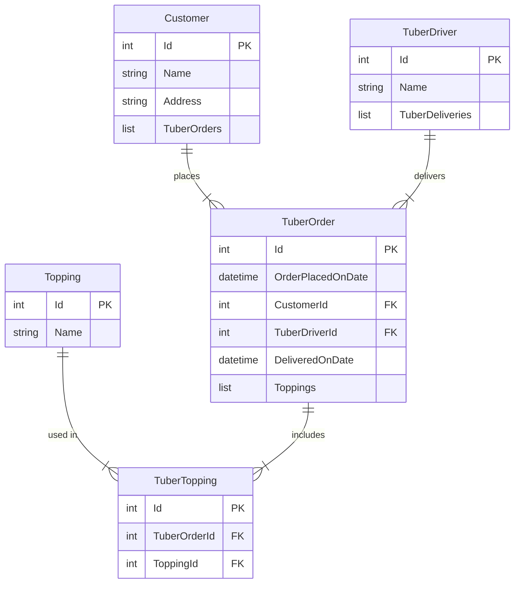

```mermaid
erDiagram

    Customer ||--|{ TuberOrder : places
    TuberDriver ||--|{ TuberOrder : delivers
    Topping ||--|{ TuberTopping : "used in"
    TuberOrder ||--|{ TuberTopping : includes


    TuberOrder {
        int Id PK
        datetime OrderPlacedOnDate
        int CustomerId FK
        int TuberDriverId FK
        datetime DeliveredOnDate
        list Toppings
    }
    Topping {
        int Id PK
        string Name
    }

    TuberTopping {
        int Id PK
        int TuberOrderId FK
        int ToppingId FK
    }

    TuberDriver {
        int Id PK
        string Name
        list TuberDeliveries
    }

    Customer {
        int Id PK
        string Name
        string Address
        list TuberOrders
    }
```
